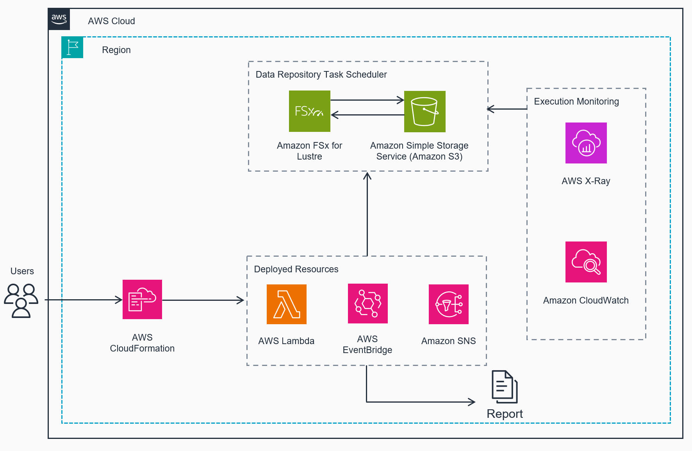

# Guidance for FSx for Lustre Data Repository Task Scheduler

## Table of Contents

1. [Solution Overview](#solution-overview)
    - [Cost](#cost)
2. [Prerequisites](#prerequisites)
3. [Core Services](#core-services)
4. [Deployment Steps](#deployment-steps)
5. [Deployment Validation](#deployment-validation)
6. [Troubleshooting](#troubleshooting)
7. [Next Steps](#next-steps)
8. [Cleanup](#cleanup)

## Solution Overview

This solution automates the scheduling and execution of FSx for Lustre data repository tasks through a serverless architecture. The solution deploys several integrated AWS services that work together to provide reliable, scheduled data synchronization between FSx for Lustre and Amazon S3.

### Core Workflow

The solution implements a scheduled workflow that operates as follows:

1. An Amazon EventBridge (CloudWatch Events) rule triggers the AWS Lambda function based on a user-defined schedule using cron expressions.

2. The Lambda function performs several key operations:
   - Retrieves the FSx file system details and Data Repository Association (DRA) information
   - Validates the paths and configurations
   - Creates appropriate data repository tasks for either import or export operations
   - Handles error conditions and reports status

3. CloudWatch monitors the Lambda execution and triggers alarms if failures occur, which are then routed through SNS to notify administrators.

### Key Components

- **Infrastructure Management**: AWS CloudFormation handles the entire infrastructure deployment, including IAM roles, Lambda functions, EventBridge rules, and monitoring resources.

- **Task Execution**: The Lambda function uses the FSx API to create data repository tasks, supporting both IMPORT_METADATA_FROM_REPOSITORY and EXPORT_TO_REPOSITORY operations.

- **Monitoring and Observability**: The solution implements comprehensive monitoring through:
  - CloudWatch Logs for Lambda function logging
  - CloudWatch Alarms for error detection
  - X-Ray for distributed tracing
  - SNS notifications for failure alerts

### Error Handling

The solution includes the following error handling mechanisms:
- Validates all required environment variables before execution
- Implements exception handling in the Lambda function
- Creates CloudWatch alarms to monitor for execution failures
- Sends immediate notifications through SNS when issues occur

### Security

Security is implemented through:
- IAM roles with least-privilege permissions
- Secure parameter handling through environment variables
- CloudWatch logs for audit trails
- X-Ray tracing for security and performance monitoring

### Customization and Scaling

The solution can be customized through CloudFormation parameters, allowing users to configure:
- Schedule frequency using cron expressions
- File system paths for synchronization
- Task types (import/export)
- Notification endpoints
- Completion report locations

This architecture ensures reliable, automated data synchronization between FSx for Lustre and S3 while maintaining operational visibility and control.

The solution works as follows:

1. An AWS EventBridge rule triggers the Lambda function on a schedule.
2. The Lambda function retrieves the FSx for Lustre file system details and Data Repository Association (DRA) information.
3. Based on the configured task type (import or export), the function creates a data repository task.
4. The task execution is monitored, and any errors trigger a CloudWatch alarm, which sends a notification via SNS.

### Cost

You are responsible for the cost of the AWS services used while running this Guidance. As of April 2025, the cost for running this Guidance with the default settings in the US East (N. Virginia) Region is approximately $5.00 per month for processing (assuming daily executions).

We recommend creating a [Budget](https://docs.aws.amazon.com/cost-management/latest/userguide/budgets-managing-costs.html) through [AWS Cost Explorer](https://aws.amazon.com/aws-cost-management/aws-cost-explorer/) to help manage costs. Prices are subject to change. For full details, refer to the pricing webpage for each AWS service used in this Guidance.

#### Sample Cost Table

The following table provides a sample cost breakdown for deploying this Guidance with the default parameters in the US East (N. Virginia) Region for one month.

| AWS service  | Monthly Transactions | Cost [USD] |
| ----------- | ------------ | ------------ |
| AWS Lambda | 30 invocations per month, 128 MB memory, 30 second average duration | $0.00 |
| Amazon CloudWatch | 1 custom metric, 1 alarm, 30 data points per month | $1.00 |
| Amazon SNS | 10 email notifications per month | $0.00 |
| AWS CloudFormation | Template and stack management | $0.00 |

The costs of the Amazon FSx for Lustre file system and associated Amazon Simple Storage Service (S3) costs are not included in this estimate. 

## Core Services

| Service | Purpose | Key Features |
|---------|---------|--------------|
| [Amazon FSx for Lustre](https://docs.aws.amazon.com/fsx/latest/LustreGuide/what-is.html) | High-performance file system | Provides high-performance shared storage with S3 integration |
| [Amazon S3](https://docs.aws.amazon.com/AmazonS3/latest/userguide/Welcome.html) | Object storage | Serves as data repository for FSx for Lustre filesystem |
| [AWS Lambda](https://docs.aws.amazon.com/lambda/latest/dg/welcome.html) | Task execution | Executes Python code to manage FSx data repository tasks |
| [Amazon EventBridge](https://docs.aws.amazon.com/eventbridge/latest/userguide/eb-what-is.html) | Scheduling | Provides scheduled triggers for automated task execution |
| [Amazon CloudWatch](https://docs.aws.amazon.com/AmazonCloudWatch/latest/monitoring/WhatIsCloudWatch.html) | Monitoring and alerting | Monitors Lambda execution and provides alerting capabilities |
| [Amazon SNS](https://docs.aws.amazon.com/sns/latest/dg/welcome.html) | Notifications | Delivers email notifications for system alerts and failures |
| [AWS CloudFormation](https://docs.aws.amazon.com/AWSCloudFormation/latest/UserGuide/Welcome.html) | Infrastructure deployment | Manages AWS resources through infrastructure as code |
| [AWS X-Ray](https://docs.aws.amazon.com/xray/latest/devguide/aws-xray.html) | Distributed tracing | Provides tracing and debugging for Lambda function execution |

## Prerequisites

### AWS Account Requirements
- Active AWS account with administrative access or 
- Permissions to create and manage the [core services](#core-services)

### Required Resources
- An existing Amazon FSx for Lustre file system
- An S3 bucket with an active Data Repository Association (DRA)
- A valid email address for notifications

### Technical Requirements
- AWS CLI version 2.x or later (if deploying via CLI), or AWS CloudShell
- Understanding of cron expressions for scheduling
- Knowledge of FSx fx for Lustre data repository tasks

> **Note**: Review the AWS service quotas in your account and request increases if needed before deployment.

## Deployment Steps

### AWS Management CloudFormation Console Deployment

1. **Create Stack**
   - Navigate to CloudFormation console
   - Click "Create stack" (with new resources)

2. **Specify Template**
   - Select "Upload a template file"
   - Click "Choose file"
   - Upload the CloudFormation template from your local system

3. **Stack Details**
   - Enter a stack name
   - Configure required parameters
   - Click "Next"

4. **Configure Stack Options** (Optional)
   - Add tags (key-value pairs)
   - Set permissions
   - Configure advanced options:
     - Stack policy
     - Rollback configuration
     - Notification options
     - Stack creation options
   - Click "Next"

5. **Review**
   - Verify stack details and configuration
   - Review estimated costs
   - Acknowledge IAM resource creation (check the box)
   - Click "Create stack"

> **Note**: The stack creation process may take several minutes to complete. You can monitor the progress in the CloudFormation console.

### AWS Command Line Deployment

#### Operating System

These deployment instructions are optimized to best work on Amazon Linux 2 AMI. Deployment in another OS may require additional steps.

Required packages:
- AWS CLI (version 2.x or later)
- Python 3.8 or later

To install the AWS CLI on Amazon Linux 2:

```bash
curl "https://awscli.amazonaws.com/awscli-exe-linux-x86_64.zip" -o "awscliv2.zip"
unzip awscliv2.zip
sudo ./aws/install
```
1. Clone the repository:

```bash
git clone https://github.com/aws-solutions-library-samples/guidance-for-fsx-for-lustre-data-repository-task-scheduler.git
```

2. Navigate to the cloned directory:

```bash
cd src/cf
```

3. Create a parameters.json file with the following content, replacing the placeholder values:

```json
[
  {
    "ParameterKey": "EmailAddress",
    "ParameterValue": "your-email@example.com"
  },
  {
    "ParameterKey": "Schedule",
    "ParameterValue": "15 6 * * ? *"
  },
  {
    "ParameterKey": "FileSystemId",
    "ParameterValue": "fs-0123456789abcdef0"
  },
  {
    "ParameterKey": "Paths",
    "ParameterValue": "/drt-test"
  },
  {
    "ParameterKey": "TaskType",
    "ParameterValue": "Import"
  }
]
```

#### Parameter Definitions

| Parameter | Description | Allowed Values | Example | Default |
|-----------|-------------|----------------|---------|---------|
| EmailAddress | Destination email for alarm notifications | Valid email address format | user@example.com | None |
| Schedule | Cron expression for task execution timing | Standard cron expression with 6 fields:<br>`minute hour day-of-month month day-of-week year` | `15 6 * * ? *`<br>(daily at 6:15 AM UTC) | `0 0/6 * * ? *`<br>(every 6 hours) |
| FileSystemId | Identifier of the FSx for Lustre file system | Must match pattern:<br>`fs-[a-z0-9]{17}` | `fs-0123456789abcdef0` | None |
| Paths | File system paths to include in repository task | Up to 32 space-separated paths.<br>Paths with spaces must be quoted | `/dir1 /dir_2 "/dir 3" /dir4/file1` | `/` |
| TaskCompletionReportPath | S3 prefix for task completion reports | Valid S3 path prefix | `/fsx-drt-completion-reports` | `/fsx-drt-completion-reports` |
| TaskType | Type of repository task to execute | One of:<br>- `Export`<br>- `Import` | `Export` | `Export` |

### TaskType Details

#### Export Task (`EXPORT_TO_REPOSITORY`)
- **API Translation**: `Type: EXPORT_TO_REPOSITORY`
- **Function**: Exports data from FSx for Lustre to the linked S3 bucket
- **Operation Details**:
  - Writes modified files from FSx to S3
  - Updates S3 objects to match FSx content
  - Creates new objects in S3 for new files
  - Maintains file metadata and permissions
  - Generates completion report in specified S3 location

#### Import Task (`IMPORT_METADATA_FROM_REPOSITORY`)
- **API Translation**: `Type: IMPORT_METADATA_FROM_REPOSITORY`
- **Function**: Updates FSx for Lustre metadata from linked S3 bucket
- **Operation Details**:
  - Updates file and directory listings in FSx
  - Does not transfer actual file content
  - Updates file metadata (size, timestamps)
  - Adds new file entries for new S3 objects
  - Generates completion report in specified S3 location

### Schedule Configuration

The Schedule parameter uses standard cron expression format with 6 fields:
`minute hour day-of-month month day-of-week year`

Examples:
- `15 6 * * ? *` = Run at 6:15 AM UTC every day
- `0 0/6 * * ? *` = Run every 6 hours
- `0/5 * * * ? *` = Run every 5 minutes
- `0 12 ? * MON-FRI *` = Run at noon UTC Monday through Friday

Common settings:
| Time Pattern | Description |
| ------------ | ----------- |
| `15 6 * * ? *` | Daily at 6:15 AM UTC |
| `0 */12 * * ? *` | Every 12 hours |
| `0 0 1 * ? *` | Monthly on the 1st at midnight UTC |
| `0 8 ? * MON *` | Weekly on Monday at 8:00 AM UTC |

Note: The `?` character is used in the day-of-month or day-of-week field to indicate "no specific value" when the other field has a specific value.

4. Deploy the CloudFormation stack:

```bash
aws cloudformation create-stack \
  --stack-name fsx-drt-scheduler \
  --template-body file://data-repository-task-scheduler.yaml \
  --parameters file://parameters.json \
  --capabilities CAPABILITY_IAM
```

5. Wait for the stack creation to complete:

```aws cloudformation wait stack-create-complete --stack-name fsx-drt-scheduler```

## Deployment Validation

To validate the deployment:

1. Check the CloudFormation stack status:

```bash
aws cloudformation describe-stacks --stack-name fsx-drt-scheduler --query 'Stacks[0].StackStatus'
```

The output should be "CREATE_COMPLETE".

2. Verify the Lambda function was created:

```bash
aws lambda list-functions --query 'Functions[?starts_with(FunctionName, `fsx-drt-scheduler`)].FunctionName'
```

You should see the name of the created Lambda function in the output.

## Troubleshooting

### Manual Testing and Verification

1. Get the Lambda function name from CloudFormation stack:
```bash
# Get function name from CloudFormation stack outputs
aws cloudformation describe-stacks \
    --stack-name <stack-name> \
    --query 'Stacks[0].Outputs[?OutputKey==`FunctionName`].OutputValue' \
    --output text

# Or get function name based on stack name pattern
aws lambda list-functions \
    --query 'Functions[?starts_with(FunctionName, `fsx-drt-scheduler`)].FunctionName' \
    --output text
```

2. Manually invoke the Lambda function (using the name from step 1):
```bash
aws lambda invoke \
    --function-name <output_from_step_1> \
    --payload '{}' \
    output.json
```

3. Check the execution output:
```bash
cat output.json
```

The response should contain task details including TaskId and Lifecycle status.

### Common Issues and Solutions

#### Lambda Function Failures
- **Error**: "ResourceNotFoundException" for FSx filesystem
  - **Solution**: Verify FileSystemId parameter is correct and filesystem exists
  - **Check**: Use `aws fsx describe-file-systems` to list available systems

- **Error**: "InvalidParameterException" for paths
  - **Solution**: Ensure paths follow correct format and exist in filesystem
  - **Check**: Verify paths in FSx filesystem using Lustre client

#### Data Repository Task Failures
- **Error**: "ValidationException" for DRA
  - **Solution**: Confirm Data Repository Association is active
  - **Check**: Use `aws fsx describe-data-repository-associations` command

- **Error**: "ServiceQuotaExceededException"
  - **Solution**: Wait for existing tasks to complete or request quota increase
  - **Check**: Monitor task status in FSx console

#### CloudWatch Alarms
- **Issue**: Missing alarm notifications
  - **Solution**: Verify SNS topic subscription confirmation
  - **Check**: Confirm email subscription in SNS console

- **Issue**: False positive alarms
  - **Solution**: Adjust alarm thresholds in CloudFormation template
  - **Check**: Review CloudWatch metrics for normal patterns

### Logging and Debugging

1. Check CloudWatch Logs:
```bash
aws logs get-log-events \
  --log-group-name /aws/lambda/<function-name> \
  --log-stream-name <stream-name>
```

2. Monitor X-Ray traces:
- Navigate to X-Ray console
- Select trace map for Lambda function
- Analyze timing and error patterns

### Recovery Steps

1. For failed tasks:
```bash
# Get task status
aws fsx describe-data-repository-tasks \
  --task-ids <task-id>

# Cancel stuck task if needed
aws fsx cancel-data-repository-task \
  --task-id <task-id>
```

2. Reset alarm state:
```bash
aws cloudwatch set-alarm-state \
  --alarm-name <alarm-name> \
  --state-value OK \
  --state-reason "Manual reset"
```

## Next Steps

- Modify the Schedule parameter in the CloudFormation template to adjust the frequency of the data repository tasks.
- Customize the Lambda function code to add additional logic or error handling as needed for your specific use case.
- Integrate with other AWS services such as AWS Step Functions for more complex orchestration of data processing workflows.

## Cleanup

To delete all resources created by this Guidance:

1. Delete the CloudFormation stack:

```
aws cloudformation delete-stack --stack-name <stack-name>
```

2. Wait for the stack deletion to complete:

```
aws cloudformation wait stack-delete-complete --stack-name <stack-name>
```

Note: This will not delete your FSx for Lustre file system or associated S3 bucket. You will need to manage those resources separately.

## License

MIT License

```plaintext
Copyright (c) 2025 Amazon.com

Permission is hereby granted, free of charge, to any person obtaining a copy
of this software and associated documentation files (the "Software"), to deal
in the Software without restriction, including without limitation the rights
to use, copy, modify, merge, publish, distribute, sublicense, and/or sell
copies of the Software, and to permit persons to whom the Software is
furnished to do so, subject to the following conditions:

The above copyright notice and this permission notice shall be included in all
copies or substantial portions of the Software.

THE SOFTWARE IS PROVIDED "AS IS", WITHOUT WARRANTY OF ANY KIND, EXPRESS OR
IMPLIED, INCLUDING BUT NOT LIMITED TO THE WARRANTIES OF MERCHANTABILITY,
FITNESS FOR A PARTICULAR PURPOSE AND NONINFRINGEMENT. IN NO EVENT SHALL THE
AUTHORS OR COPYRIGHT HOLDERS BE LIABLE FOR ANY CLAIM, DAMAGES OR OTHER
LIABILITY, WHETHER IN AN ACTION OF CONTRACT, TORT OR OTHERWISE, ARISING FROM,
OUT OF OR IN CONNECTION WITH THE SOFTWARE OR THE USE OR OTHER DEALINGS IN THE
SOFTWARE.
```

## Version History

### 1.0.0 (2025-03-27)
* Initial release
* Import/Export functionality
* CLI support
* Lambda deployment support
* Comprehensive error handling
* Detailed completion reports

## Support

* Open an issue for bug reports
* Feature requests welcome
* Pull requests encouraged

## Authors

**Romi Asad, romiasad@amazon.com, GitHub: romi1495**

**Tom McDonald, tjm@amazon.com, GitHub: tjmaws**

## Acknowledgments

* Original Project contributors

    **Darryl Osborne, darrylo@amazon.com**

    **Shrinath Kurdekar, kurdekar@amazon.com**

---